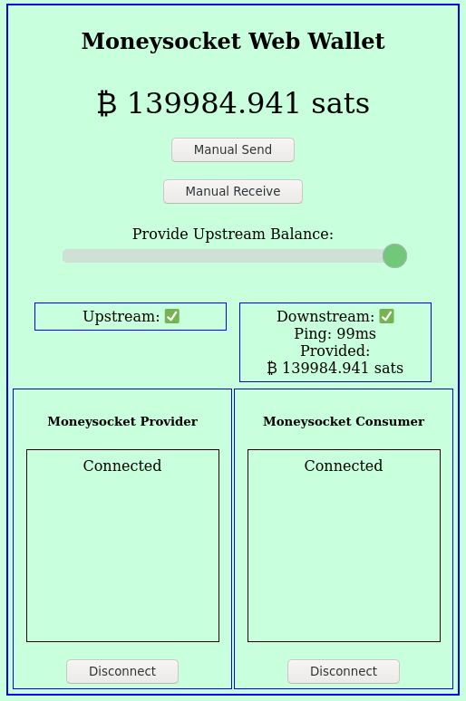

Moneysocket Web Wallet
-----

A rudimentary browser-based wallet app which connects as a Moneysocket consumer to a provider with a balance. Additionally, it provides a Moneysocket provider connection for an app to use.

A better wallet is needed to be end-user ready, this was built in conjuction with the rest of the infrastructure to test, so it is a bit underdeveloped when it comes to user-friendliness.

A build of the wallet is hosted [here](https://socket.money/wallet).

[Donate](https://socket.money/#donate)

Disclaimer!
-----

Moneysocket is still new, under development and is Reckless with your money. Use this stuff at your own risk.

The Version number of this package and on the protocol is set to `0.0.0` for the time being since we anticipate that the protocol specifics will change in breaking ways prior to an 'official' release.

Dependencies
------------------------------------------------------------------------

This depends on [js-moneysocket](https://github.com/moneysocket/js-moneysocket) which will need to be installed into `node_modules` prior to building this project.

`$ git clone https://github.com/moneysocket/web-wallet`

`$ cd web-wallet`

`$ npm install https://github.com/moneysocket/js-moneysocket`

Also, [package.json](package.json) specifies additional dependencies that will need to be installed. From the cloned directory:

`$ npm install`

Building
------------------------------------------------------------------------

This uses `gulp` to build the application.

From the cloned directory with the dependencies installed:

`$ gulp quick` will build to the `htdocs/` directory

`$ gulp full` will take longer but will produce optimized javascript

`$ gulp quick_watch` will watch the source files for changes and automatically rebuild

Running
------------------------------------------------------------------------

Once, built the web root will be set up under `htdocs/`. If you want to run it locally, use a webserver. eg:

`$ cd htdocs`
`$ python -m SimpleHTTPServer 1234`

and point your browser at the port. eg:

`$ firefox http://localhost:1234`

Project Links
------------------------------------------------------------------------

- [Homepage](https://socket.money).
- [Twitter](https://twitter.com/moneysocket)
- [Telegram](https://t.me/moneysocket)
- [Donate](https://socket.money/#donate)
